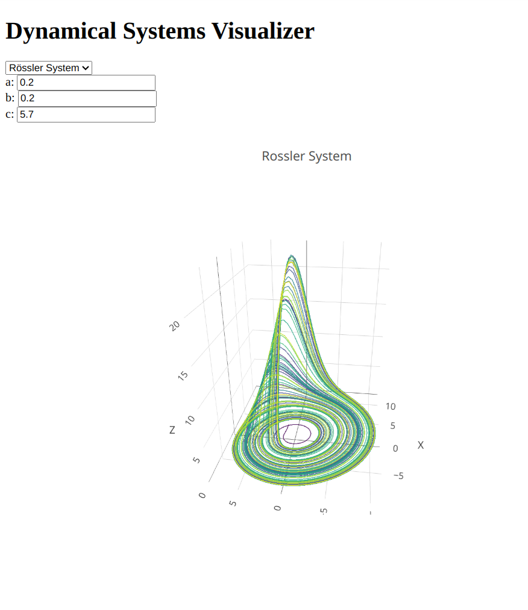

# Nonlinear Dynamics and Chaos

A repository for exploring nonlinear dynamics, chaos, fractals, and related topics using Python.

# Dynamical Systems Visualizer

The Dynamical Systems Visualizer is a modular, containerized web application for modeling and visualizing a variety of chaotic and dynamical systems in two or three dimensions. The app is fully Dockerized and can be run locally or deployed to the cloud with ease.

## Visualizations

The visualizer provides interactive 3D renderings of several well-known dynamical systems. Example screenshots:

These visualizations highlight the rich and complex behaviors of nonlinear systems, including chaos and fractal structures.

## Frontend

- **Lightweight & High-Performance:** Built with vanilla JavaScript and Three.js, without heavy frameworks.
- **Interactive Controls:** Real-time camera manipulation (rotate, pan, zoom) and parameter adjustment.
- **Responsive Design:** Works on both desktop and mobile devices.
- **Multiple Systems Supported:** Lorenz, Rössler, Chua, and Chen attractors, with more planned.
- **Development:** Easily served locally with any static file server or via Docker.

## Backend

- **Modern Python API:** Implemented with FastAPI and Pydantic for robust, type-safe endpoints.
- **Dynamical System Computation:** Supports multiple systems (Lorenz, Rössler, Chua, Chen, etc.) with real-time parameterization.
- **CORS Enabled:** Allows seamless communication with the frontend.
- **Containerized:** Runs in its own Docker container for isolation and reproducibility.

## Docker

- **Separation of Concerns:** Frontend and backend are containerized separately for modular deployment.
- **Simple Orchestration:** Use `docker-compose` to build and run the entire application stack.
- **Consistent Environments:** Ensures identical behavior across platforms and deployments.

## Future Developments

- Refactor and modularize visualization code for easier extension.
- Add more dynamical systems and visualization types.
- Expand unit testing and improve logging for reliability.
- Enhance user interface and add more interactive features.

See the `dynamical_systems_visualizer` directory for up-to-date code and documentation.
